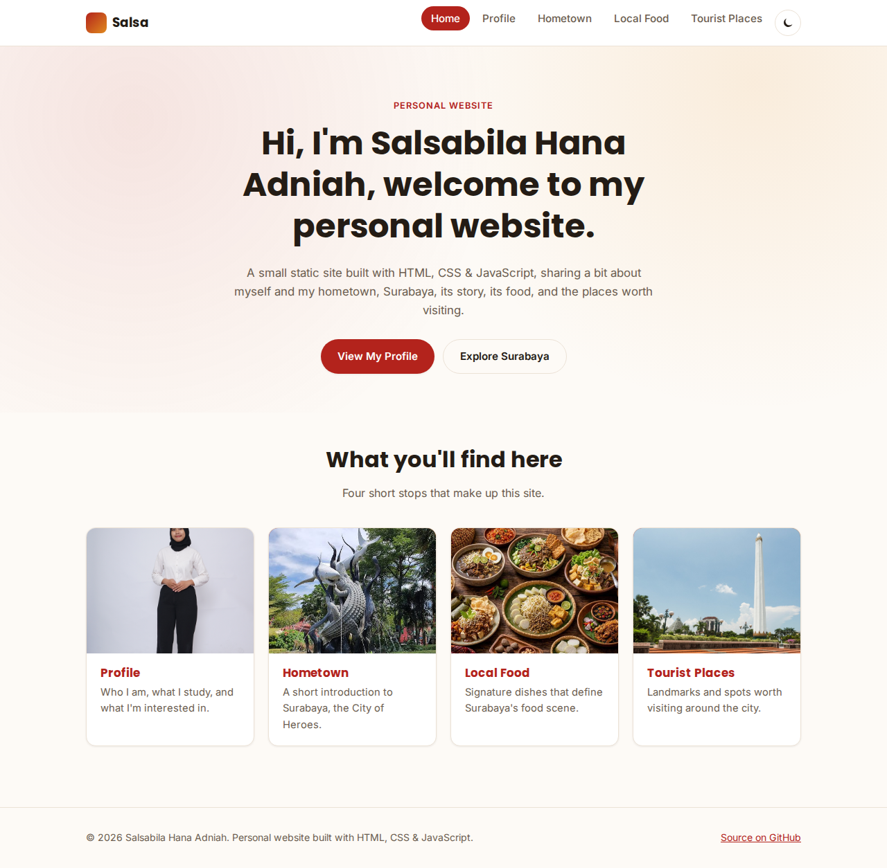
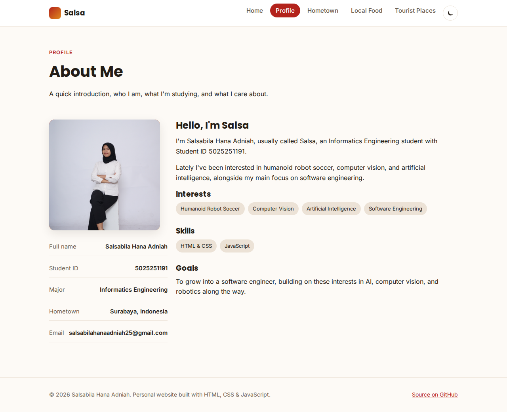
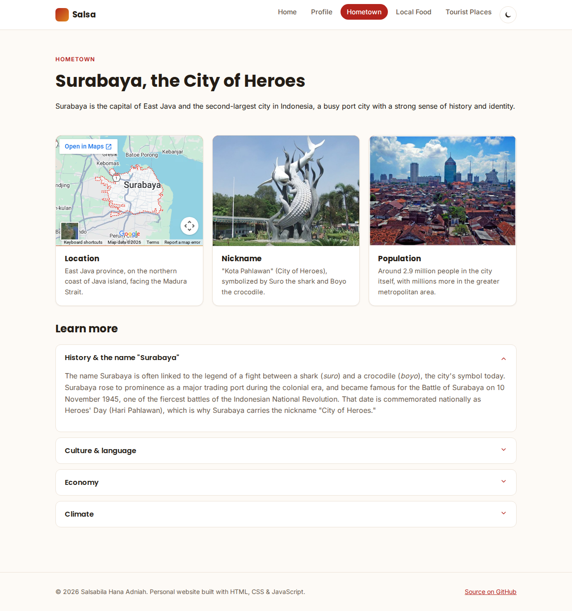
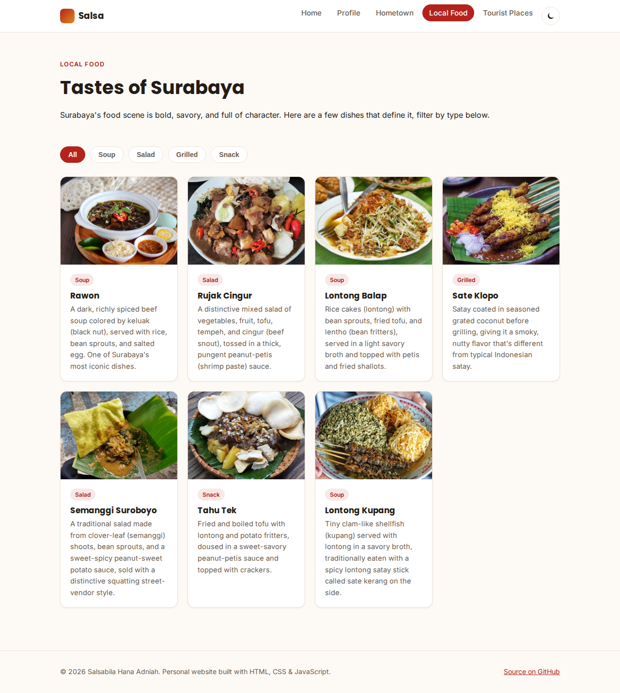
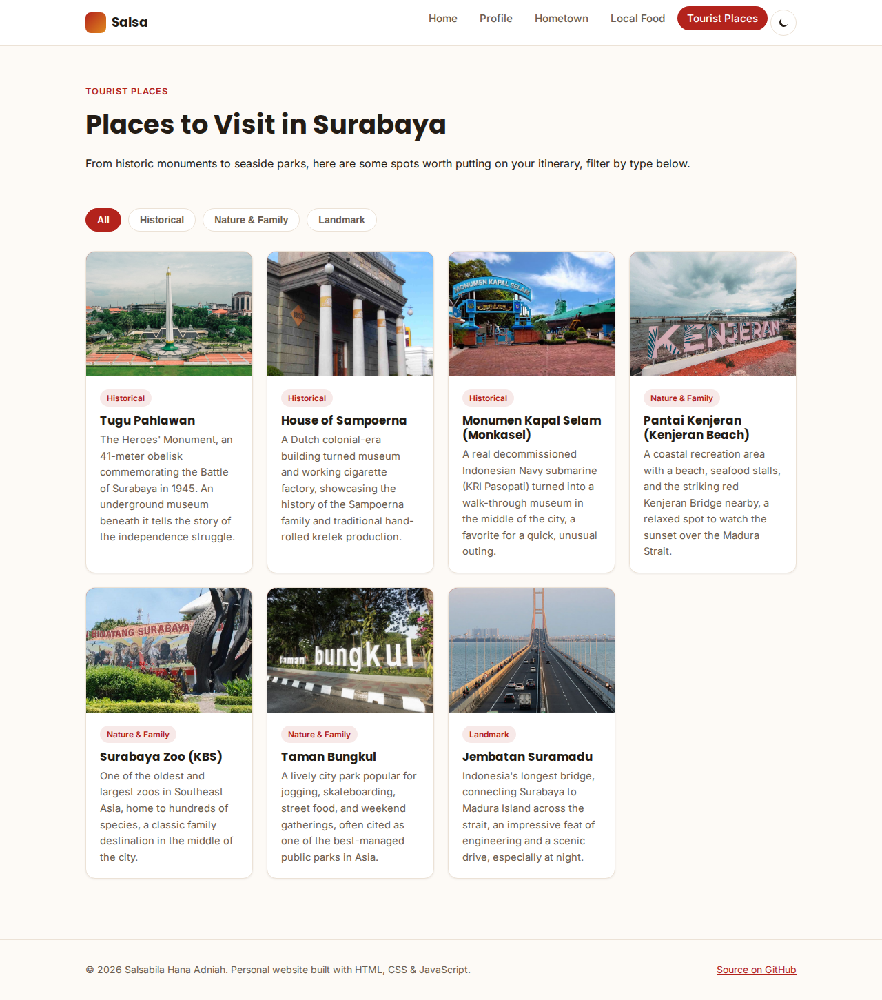
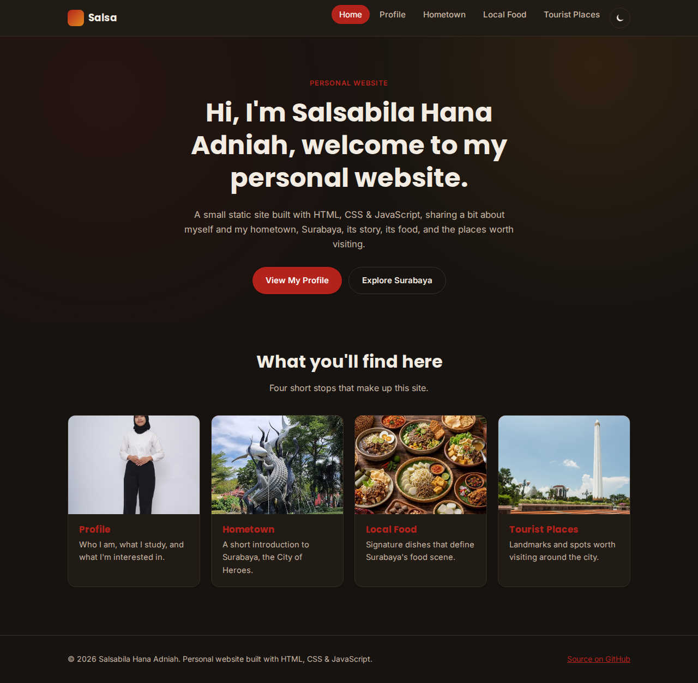

# Personal Website

Static personal website built with HTML, CSS, and vanilla JavaScript.

## Site map

- Homepage: `<your-domain>/`
- Profile: `<your-domain>/profile`
- Hometown: `<your-domain>/hometown`
- Local Food: `<your-domain>/food`
- Tourist Places: `<your-domain>/tourist`

## Structure

```
index.html            Homepage
profile/index.html    Profile page
hometown/index.html   Hometown page
food/index.html       Local Food page
tourist/index.html    Tourist Places page
assets/
  css/style.css        Shared stylesheet
  js/main.js            Shared interactivity (nav toggle, theme toggle,
                         accordion, filter tabs, back-to-top)
  img/                   Photos and illustrations used across the site
```

## Running locally

No build step is required. Serve the folder with any static server, e.g.:

```bash
npx serve .
# or
python3 -m http.server
```

Then visit `http://localhost:<port>/`.

## Deployment (GitHub Pages)

1. Push this repository to GitHub.
2. In the repository settings, enable **GitHub Pages** for the `main` branch, root folder.
3. The site will be published at `https://<username>.github.io/<repo>/`.

---

## Project Report

Name: Salsabila Hana Adniah
NRP: 5025251191
Class: Pweb D

### 1. Design Concept & Structure

The site is a small personal portfolio made of five static pages that share one visual language: Home, Profile, Hometown, Local Food, and Tourist Places. Every page reuses the same header, footer, and design tokens, so navigating between pages feels like one continuous site rather than five separate documents.

**Visual design**

- Color palette built around a "heroic red" (`--color-primary: #b3231c`) and warm orange accent, a nod to Surabaya's nickname "Kota Pahlawan" (City of Heroes). A parallel dark palette is defined for dark mode.
- Typography pairs Poppins (headings) with Inter (body text), loaded from Google Fonts.
- Layout is card-based throughout: `media-card` for image-plus-text items (home shortcuts, food, tourist places, hometown facts), `stat-list` and `pill` tags for the profile summary, and an `accordion` for the longer hometown content so the page stays scannable.
- Navigation is a sticky header with a horizontal link list on desktop that collapses into a toggleable dropdown on mobile (`<720px`), plus a persistent dark/light toggle and a "back to top" button that appears after scrolling.

**File structure**

```
index.html            Homepage
profile/index.html    Profile page
hometown/index.html   Hometown page
food/index.html       Local Food page
tourist/index.html    Tourist Places page
assets/
  css/style.css        Shared stylesheet (design tokens, layout, components)
  js/main.js            Shared interactivity
  img/                   Photos and illustrations, grouped by page/section
```

Each page folder holds its own `index.html` so links stay clean (`/profile/` instead of `/profile.html`), which also makes the site easy to extend with more pages later without touching what already exists.

### 2. Screenshots

**Home**



**Profile**



**Hometown**



**Local Food**



**Tourist Places**



**Dark mode (Home)**



### 3. Code & Implementation Choices

- **HTML**: plain, semantic HTML per page (`header`, `nav`, `main`, `section`, `footer`), no templating engine or framework. For a five-page site this keeps things simple to read and deploy anywhere, at the cost of repeating the header/footer markup in each file.
- **CSS (`assets/css/style.css`)**: design tokens (colors, spacing, shadows, fonts) are defined once as custom properties on `:root`, then reused everywhere. Dark mode is handled two ways: automatically via `@media (prefers-color-scheme: dark)`, and manually via a `data-theme="dark"` attribute the toggle button sets, so the site respects the visitor's system preference by default but still lets them override it.
- **JavaScript (`assets/js/main.js`)**: a single vanilla-JS file, no dependencies, that runs after `DOMContentLoaded` and wires up:
  - the mobile nav toggle,
  - active-link highlighting by comparing the current URL path against each nav link,
  - the accordion on the Hometown page (expand/collapse via `max-height` transitions),
  - the filter tabs on Local Food and Tourist Places (shows/hides cards by matching a `data-category` attribute),
  - the back-to-top button's visibility on scroll,
  - the dark/light theme toggle, persisted with `localStorage` (wrapped in `try/catch` in case storage is unavailable, e.g. private browsing).
- **Icons**: all interface icons (menu, back-to-top, accordion chevron, theme toggle) are hand-written inline SVGs using `stroke="currentColor"` / `fill="currentColor"`, so they automatically match the current text color in both light and dark mode without extra CSS rules or image requests.
- **Images**: every page uses the actual provided photos and illustrations instead of placeholders, organized under `assets/img/<page>/`, one image per card or section (profile photo, hometown nickname/population illustrations, 7 local dishes, 7 tourist places).
- **Google Maps embed**: the Hometown page's Location card embeds Google Maps via a plain `iframe` pointed at Google's public `output=embed` endpoint, centered on Surabaya. This needs no API key, keeps the page working without any external JS SDK, and shows visitors exactly where the city is.
- **Responsive layout**: card grids use CSS Grid with `repeat(auto-fit, minmax(240px, 1fr))` so the number of columns adapts to the viewport automatically, and the profile page's two-column `split` layout collapses to a single column under 720px.

### 4. Analysis & Evaluation

**Strengths**

- Zero build step and zero runtime dependencies, so the site can be served from any static host (GitHub Pages, Netlify, a plain file server) with no compilation step.
- A single source of design tokens keeps the five pages visually consistent, and adding a new page mostly means copying the existing header/footer and writing new content inside `main`.
- Dark mode works both automatically (system preference) and manually (explicit toggle), which covers the two most common expectations visitors have.
- The interactive pieces (accordion, filters, nav toggle) are small, dependency-free, and easy to follow in a single ~80-line JS file.

**Limitations**

- Because there's no templating, shared markup (header, footer, nav links) is duplicated across all five HTML files. Any structural change to the navigation currently means editing five files instead of one.
- The source photos are high-resolution camera/illustration files that are not yet compressed or served in multiple sizes, so first load could be heavier than necessary on slow connections. Adding `loading="lazy"` and resized/optimized image variants would help.
- The Google Maps embed pulls from a third-party domain, which is a minor privacy/performance trade-off; it is mitigated here with `loading="lazy"` and a restrictive `referrerpolicy`, but a static map image would avoid the external request entirely if that mattered more than interactivity.
- Accessibility is solid but not exhaustive: focus states rely on the browser default, and there is no explicit "skip to content" link for keyboard users.

### 5. Conclusion

The result is a small, self-contained personal website that introduces who I am, my hometown Surabaya, and the food and places that define it, built entirely with HTML, CSS, and vanilla JavaScript. The project prioritized a clean, reusable design system (colors, typography, and card components) and straightforward, dependency-free interactivity over any framework overhead, which fits a project of this size well. The main opportunities for future improvement are reducing HTML duplication (e.g. by moving to a static site generator if the page count grows) and optimizing images for performance.
# surabaya-explore
